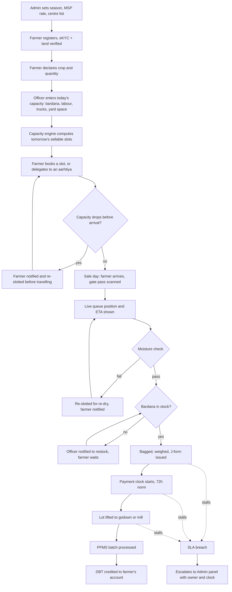

# End-to-end flow

The loop that matters most is in the middle: capacity is recomputed before a
farmer books, and again before they travel — not discovered when they are
already standing at the gate.

## Stage by stage, with the code that runs it

### 1 · Season setup — Admin

The admin sets the active season, the MSP per crop and the moisture limit.
MSP is read from `SeasonConfig` at the moment a J-form is cut, never hard-coded
into the UI.

`prisma/seed.ts` → `SeasonConfig`

### 2 · Registration — Farmer

Three steps, and the farmer panel does not exist until the first two are done.
Registration is a continuation of signing up, not a section of the dashboard:

| Step | Screen | API | Gate |
|---|---|---|---|
| 1 · Phone OTP | `/sign-up` | — (Clerk) | Clerk |
| 2 · Profile | `/onboarding` | `POST /onboarding` | grants the `farmer` role |
| 3 · Aadhaar Secure QR | `/onboarding/verify` | `POST /verify/aadhaar` | **blocks every `/farmer` route** |
| 4 · Land record | not built | not built | nothing yet |

`GET /me` reports both gates as `hasProfile` and `aadhaarVerified`, and they are
enforced in two places for two different reasons:

- **`apps/api`** re-checks them in every farmer handler. This is the real gate.
- **`apps/web`** reads `/me` once and routes accordingly, so nobody is sent to a
  panel that would 403. This is presentation, not security — it ships in a
  bundle the user can edit.

The registration flow shares one layout that deliberately composes like the
sign-in pages — centred, no panel nav — since every dashboard link would be dead
until the gate opens. It keeps a sign-out control, because with the gate
mandatory that is the only way off the screen for someone who cannot finish
right now.

Two consequences worth knowing:

- **Only a genuine UIDAI-signed QR opens the gate.** `signatureVerified` is
  what sets `Farmer.aadhaarVerified`, and the selftest payload from
  `npm run test:qr -- --emit` always reports NOT VERIFIED by design. A demo
  therefore needs a real Aadhaar card, or demo mode — `CLERK_SECRET_KEY` blank
  in `apps/api` — which skips the gate along with all auth.
- **Tenant farmers are not addressed by this.** A hard Aadhaar gate is
  defensible; the land-record step behind it is where the exclusion risk sits,
  and `VerificationMethod.OFFICER_ATTESTATION` is still unbuilt. See "Still
  open" in `AUTH.md`.

Verified acreage caps how much may be sold at MSP — the same rule Odisha's
token quota applies, but computed from the actual record rather than a flat cap.

`Farmer.aadhaarVerified`, `Farmer.landAcres`, `Farmer.landVerified`

### 3 · Capacity costing — Centre officer

Once a day, five numbers: bardana bags, labour gangs, trucks assigned,
weighbridge hours, unlifted backlog. The engine converts them into a sellable
quintal figure and names the binding constraint.

`apps/api/src/lib/capacity-engine.ts` → `POST /api/v1/centres/:id/capacity`

Publishing the day is what makes it bookable. Until then it is a draft and no
farmer sees it.

### 4 · Booking — Farmer or aarhtiya

The farmer panel only ever offers days that can still absorb their quantity.
A day that cannot is absent from the list — the system never shows a slot it
cannot keep.

`GET /api/slots` → `POST /api/bookings` → SMS `SLOT_CONFIRMED`

### 5 · Capacity drop — the differentiator

If the officer republishes with lower capacity (a truck failed to arrive,
bardana did not land), the overflow is re-slotted immediately. Youngest bookings
move first; `seniorityAt` protects anyone already bumped once. Every affected
farmer gets an SMS naming the reason.

`reslotOverflow()` in `POST /api/centres/:id/capacity`

### 6 · Sale day — live queue

Gate pass scanned, token enters the board. The ETA is computed from the centre's
*observed* service rate today, so it self-corrects rather than repeating an
optimistic plan.

`estimateWaitMinutes()` → `queue:update` over Socket.IO

### 7 · Quality gate

Moisture is recorded against the FCI limit in `SeasonConfig` (17% for paddy).
A failure creates a rejected lot, re-slots the booking and sends
`MOISTURE_FAIL` — the farmer learns the new date before leaving the yard.

`POST /api/lots`

### 8 · Weighing and J-form

A passing lot is weighed, priced at the season MSP, and given a J-form number.
That timestamp starts the 72-hour payment clock and sets `slaDueAt`.

`POST /api/lots` → `slaDueAt()` → SMS `JFORM_ISSUED`

### 9 · Payment, five derived stages

| Stage | Set by | Owner |
|---|---|---|
| J-form issued | Centre officer | Centre officer |
| Lot lifted | Transport update | Transport contractor |
| Agency acknowledged | Agency receipt | Procurement agency |
| Sent for payment | PFMS batch | District treasury |
| Credited | Bank confirmation | — |

The stage is always derived from timestamps by `deriveStage()`, never typed in,
so the tracker cannot disagree with what happened.

`POST /api/lots/:id/stage`

### 10 · Escalation

Any lot past 72 hours from its J-form is flagged, attributed to the office that
owns its current stage, and pushed to the admin panel with a running clock.

`isBreached()`, `ownerOf()` → `admin:escalation`

## The two loops worth demonstrating

**Loop A — capacity drop before travel.** Publish capacity, book slots to fill
it, then republish with fewer trucks. Watch farmers get re-slotted and notified
while still at home. This is the whole pitch in thirty seconds.

**Loop B — moisture failure.** Record 20% moisture on a token. The booking
re-slots, the farmer is told the new date and why, and the wasted trip is not
repeated next week.
